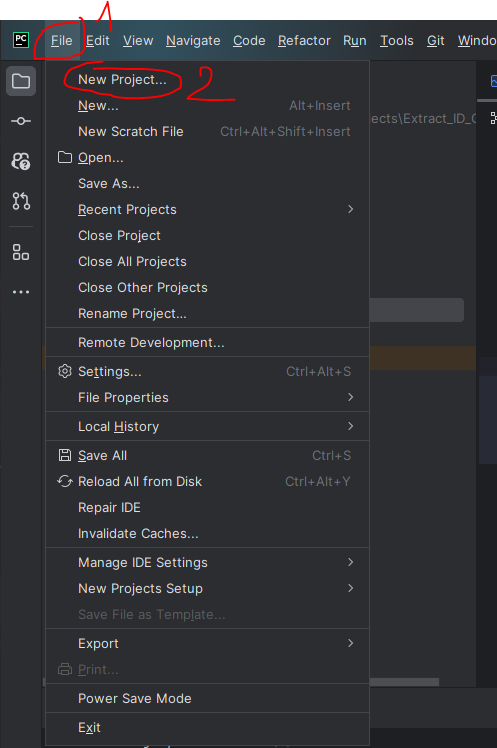
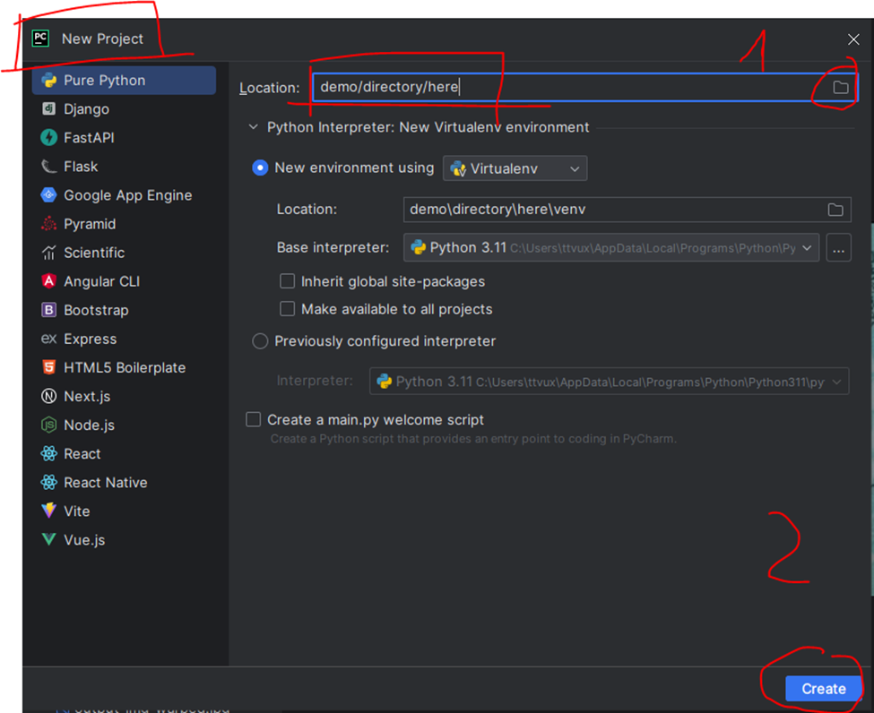
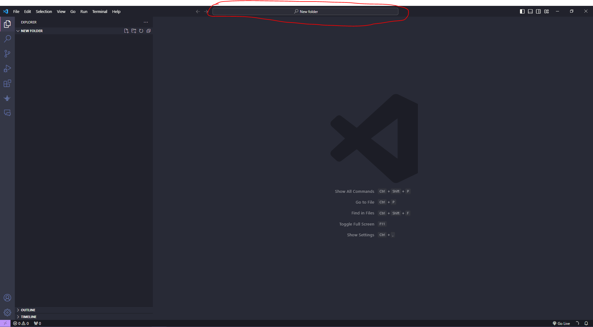
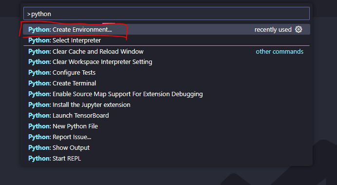
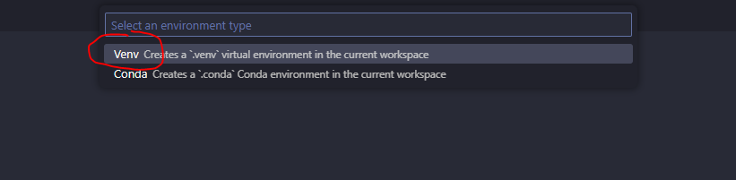
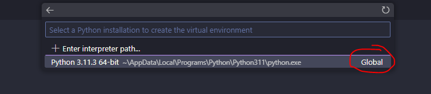
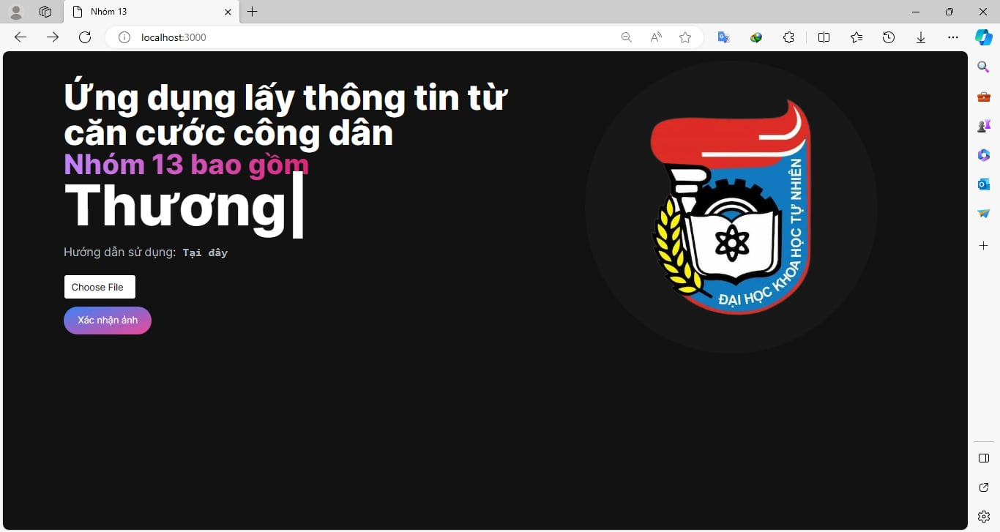

<H1 align="center"> Extract ID Card information </H1>

## Steps to install

- Download NodeJS : https://nodejs.org/en/download


- Use node --version and npm --version to check version : node v20.10.0 and npm 10.2.3.


- You should create a virtual environment ( just google "why i should use venv" )


1. If you use Pycharm ( suggest )

  

  

   
2. If you use VSCode

  

  

  

  

- Open terminal in IDE, clone the repository
```
git clone https://github.com/vux-66a5/Extract_ID_Card.git
```
- Go to the cloned folder.
```
cd .\Extract_ID_Card\
```
- Install requirements
```
pip install -r .\requirements.txt 
```

- (Skip this in the first time install) If any ModuleNotFoundError appear when execute the code , try run this code in pip.txt file to install requirements again, and then re-execute the code
```
python3 -m pip install -r requirements.txt
```

- Go to interface folder.
```
cd FE
```

- Install react-type-animation.
```
npm install react-type-animation
```

- Install axios.
```
npm install axios
```


- Run project.
```
npm run dev
```

- Open browser, go to localhost.
```
http://localhost:3000/
```
### RESULTS

  
